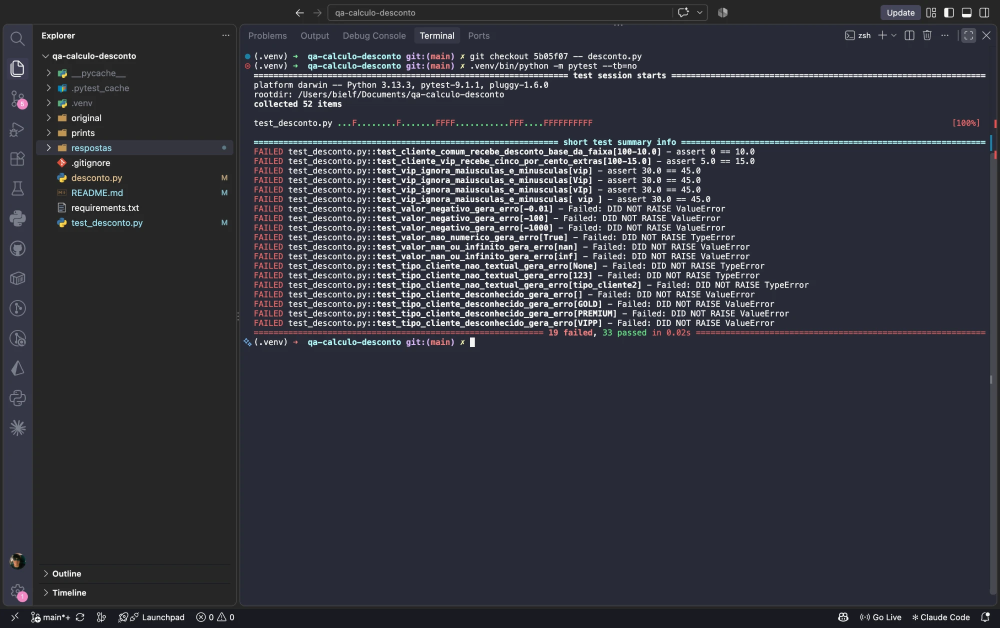
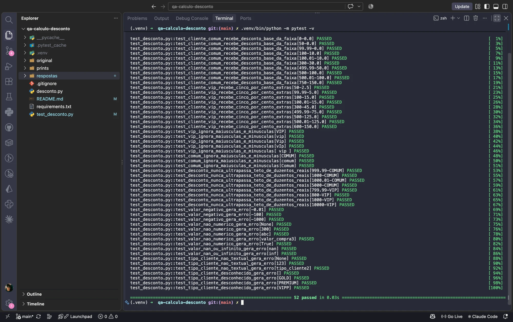

# QA – Cálculo de Desconto Progressivo

> **Trabalho acadêmico.** Este repositório é a entrega do desafio prático "Auditoria e Caça aos Bugs (Testes Unitários Automatizados)" do Marco VA01 da disciplina de Qualidade de Software, do IESP Faculdades. Não é um projeto de produção.

## O desafio

Um Dev Jr. entregou a função `calcular_desconto(valor_compra, tipo_cliente)` sem testes unitários, tendo testado "de cabeça" apenas uma compra de R$ 300. A tarefa do QA é:

1. escrever os cenários de teste a partir dos critérios de aceite;
2. automatizar os testes unitários com Pytest;
3. rodar os testes contra o código original e registrar as falhas;
4. corrigir o código até todos os testes passarem.

## Critérios de aceite

A função retorna o valor do desconto em reais (R$):

| Valor da compra | Desconto base |
|---|---|
| Menor que R$ 100,00 | 0% |
| De R$ 100,00 até menos de R$ 500,00 | 10% |
| R$ 500,00 ou mais | 20% |

- Cliente `VIP` (maiúsculo ou minúsculo) recebe 5 pontos percentuais extras sobre a porcentagem base. Cliente `COMUM` não tem acréscimo.
- Teto: o desconto nunca ultrapassa R$ 200,00.

## Respostas do desafio

| # | Item pedido | Onde está |
|---|---|---|
| 1 | Código principal corrigido | [respostas/1-codigo-corrigido.md](respostas/1-codigo-corrigido.md) |
| 2 | Cenários de teste | [respostas/2-cenarios.md](respostas/2-cenarios.md) |
| 3 | Bugs encontrados e como os testes os revelaram | [respostas/3-bugs-encontrados.md](respostas/3-bugs-encontrados.md) |
| 4 | PRINT1 – testes antes da correção | [prints/print1-antes-da-correcao.png](prints/print1-antes-da-correcao.png) |
| 5 | PRINT2 – testes depois da correção | [prints/print2-depois-da-correcao.png](prints/print2-depois-da-correcao.png) |

## Resultado dos testes

| Momento | Resultado |
|---|---|
| Antes da correção (código original) | 19 falharam, 33 passaram |
| Depois da correção | 52 passaram |

### PRINT1 – antes da correção



### PRINT2 – depois da correção



## Resumo dos bugs

1. **Fronteira dos R$ 100,00.** A condição `valor_compra > 100` deixava a compra de exatamente R$ 100,00 com 0% em vez de 10%.
2. **VIP sensível a maiúsculas.** A comparação `tipo_cliente == "VIP"` negava os 5% extras para `"vip"` e `"Vip"`.
3. **Entradas inválidas aceitas em silêncio.** Valores negativos, não numéricos e tipos de cliente desconhecidos geravam um desconto em vez de um erro.

A análise completa está em [respostas/3-bugs-encontrados.md](respostas/3-bugs-encontrados.md).

## Estrutura do projeto

```text
qa-calculo-desconto/
├── desconto.py                  código corrigido
├── test_desconto.py             testes unitários (Pytest)
├── requirements.txt             dependências
├── original/
│   └── desconto_dev_jr.py       código original entregue pelo Dev Jr.
├── respostas/
│   ├── 1-codigo-corrigido.md
│   ├── 2-cenarios.md
│   └── 3-bugs-encontrados.md
└── prints/
    ├── print1-antes-da-correcao.png
    └── print2-depois-da-correcao.png
```

## Como executar

```bash
python3 -m venv .venv
source .venv/bin/activate
pip install -r requirements.txt
pytest -v
```

O histórico de commits registra as duas etapas: o primeiro commit contém o código original com os testes, e o segundo contém a correção.
